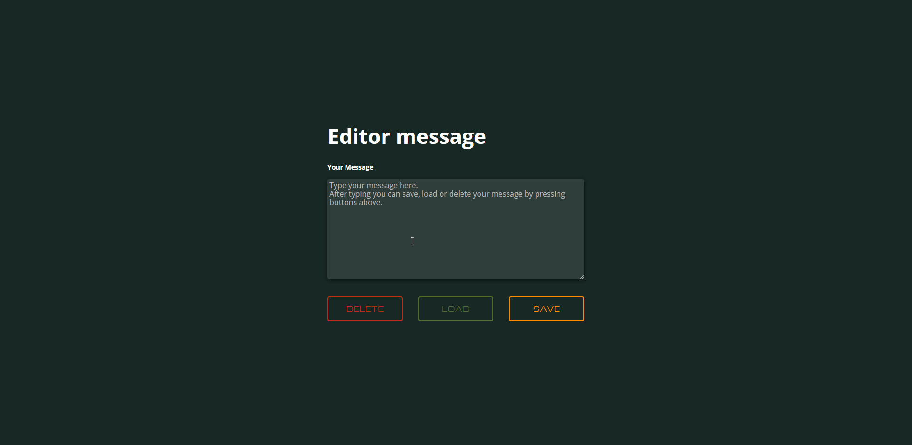

# Mój projekt: simple-editor

Zapraszam na moją stronę: [Simple editor message](https://jaruto7.github.io/simple-editor/)

## Jak uruchomić moją stronę lokalnie.

Aby załadować moją stronę użyj komend:

`npm install -g gulp-cli`

`npm install`

`gulp`

Aby opublikować u siebie stronę na github pages użyj polecenia `npm run deploy`
